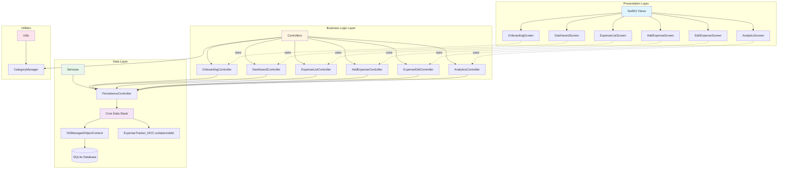
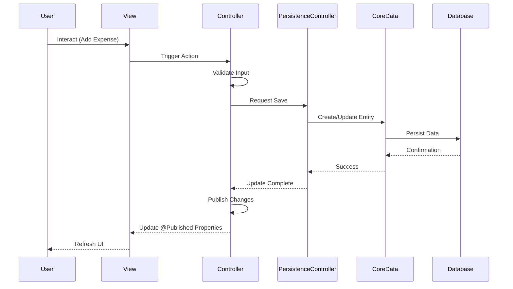

<div align="center">

#  ExpenseTracker iOS

### Modern Expense Management App Built with SwiftUI & Core Data

[](https://swift.org)
[](https://www.apple.com/ios/)
[](https://developer.apple.com/xcode/swiftui/)
[](https://developer.apple.com/documentation/coredata)

A professional-grade personal finance application that helps users track expenses, analyze spending patterns, and manage their financial health with an elegant, intuitive interface.

[Features](#-features) • [Architecture](#-architecture) • [Installation](#-getting-started) • [Usage](#-usage) • [Contributing](#-contributing)

</div>

---

##  Table of Contents

- [Overview](#-overview)
- [Features](#-features)
- [Screenshots](#-screenshots)
- [Architecture](#-architecture)
- [Tech Stack](#-tech-stack)
- [Project Structure](#-project-structure)
- [Core Data Model](#-core-data-model)
- [Getting Started](#-getting-started)
- [Usage](#-usage)
- [Roadmap](#-roadmap)
- [Contributing](#-contributing)
- [License](#-license)

---

##  Overview

**ExpenseTracker iOS** is a feature-rich personal finance application designed to simplify expense management. Built with modern iOS development practices, it leverages SwiftUI for a fluid user experience and Core Data for robust offline-first data persistence. The app follows an **MVC-inspired architecture** that promotes clean separation of concerns, maintainability, and testability.

### Key Highlights

-  **Clean Architecture**: MVC pattern adapted for SwiftUI
-  **Offline-First**: All data persists locally via Core Data
-  **Modern UI**: Built entirely with SwiftUI
-  **Smart Analytics**: Comprehensive spending insights
-  **Performance**: Optimized with reactive data binding
-  **Preview Support**: Full SwiftUI preview capabilities

---

##  Features

###  Core Functionality

| Feature | Description |
|---------|-------------|
| **Onboarding** | Smooth first-time user experience with guided setup |
| **Dashboard** | Real-time overview of daily and monthly spending |
| **Add Expense** | Quick expense entry with categories, payment methods, and notes |
| **Edit Expense** | Full CRUD operations for expense management |
| **Expense List** | Chronological view of all transactions with search and filter |
| **Analytics** | Visual spending breakdowns with insights and trends |
| **Categories** | Customizable expense categories with SF Symbols |
| **Payment Methods** | Track different payment sources |
| **Notes** | Add context to each expense |

###  Technical Features

- **Reactive Data Flow**: Real-time UI updates with Combine framework
- **Core Data Integration**: Persistent storage with NSManagedObjectContext
- **SwiftUI Previews**: Development-ready with sample data
- **Error Handling**: Comprehensive error management
- **Memory Efficient**: Optimized data fetching and caching

---


##  Architecture

This application implements a **modern MVC architecture** tailored for SwiftUI, ensuring clean separation of concerns and maintainability.

### Architecture Diagram



### Data Flow Diagram



### Layer Responsibilities

#### 1. **Presentation Layer (Views/)**
- **Responsibility**: UI rendering, user interaction, and layout
- **Technology**: SwiftUI views and modifiers
- **Pattern**: Declarative UI with reactive bindings
- **Key Principle**: Views remain thin and delegate logic to Controllers

```swift
// Example: Views observe Controllers via @ObservedObject
struct DashboardScreen: View {
    @ObservedObject var controller: DashboardController
    // View code...
}
```

#### 2. **Business Logic Layer (Controllers/)**
- **Responsibility**: Feature logic, validation, data transformation, and orchestration
- **Technology**: ObservableObject classes with @Published properties
- **Pattern**: Feature-based controllers (one per major feature)
- **Key Principle**: Controllers coordinate between Views and Services

```swift
// Example: Controllers manage business logic
@MainActor
final class DashboardController: ObservableObject {
    @Published var expenses: [Expense] = []
    func fetchExpenses() { /* ... */ }
    func todayTotal() -> Double { /* ... */ }
}
```

#### 3. **Data Layer (Services/)**
- **Responsibility**: Core Data management, persistence operations
- **Technology**: NSPersistentContainer, NSManagedObjectContext
- **Pattern**: Singleton pattern for shared persistence controller
- **Key Principle**: Centralized data access with preview support

```swift
// Example: Centralized persistence management
class PersistenceController {
    static let shared = PersistenceController()
    static let preview = PersistenceController(inMemory: true)
    let container: NSPersistentContainer
}
```

#### 4. **Utilities (Utils/)**
- **Responsibility**: Shared helper functions and managers
- **Technology**: Swift classes and structs
- **Pattern**: Utility classes for cross-cutting concerns
- **Examples**: CategoryManager for predefined expense categories

### Why This Architecture?

####  Benefits

1. **Separation of Concerns**: Clear boundaries between UI, logic, and data
2. **Testability**: Controllers can be unit tested independently
3. **Maintainability**: Changes in one layer don't cascade to others
4. **Scalability**: Easy to add new features without disrupting existing code
5. **SwiftUI Compatible**: Works naturally with SwiftUI's reactive paradigm
6. **Code Reusability**: Controllers can be shared across multiple views
7. **Preview Support**: Easy to mock data for SwiftUI previews

####  Design Decisions

- **Controllers over ViewModels**: Semantic clarity for business logic layer
- **ObservableObject Pattern**: Native SwiftUI integration with @Published
- **Reactive Updates**: Combine framework for real-time data synchronization
- **Dependency Injection**: NSManagedObjectContext injected via SwiftUI environment
- **Preview-First Development**: Dedicated preview persistence controller

---

##  Tech Stack

| Category | Technology | Purpose |
|----------|-----------|---------|
| **Language** | Swift 5.9+ | Primary development language |
| **UI Framework** | SwiftUI | Declarative user interface |
| **Persistence** | Core Data | Local data storage |
| **Architecture** | MVC | Separation of concerns |
| **Reactive** | Combine | Asynchronous data handling |
| **Platform** | iOS 17.0+ | Target platform |
| **Development** | Xcode 15+ | IDE and toolchain |

---

##  Project Structure

```text
ExpenseTracker_MVC/
├── ExpenseTracker_MVC/
│   ├── ExpenseTracker_MVCApp.swift       # App entry point
│   ├── README.md                         # This file
│   │
│   ├── Assets.xcassets/                  # App assets
│   │   ├── AccentColor.colorset/
│   │   ├── AppIcon.appiconset/
│   │   ├── background2.imageset/
│   │   └── logo2.imageset/
│   │
│   ├── Controllers/                      # Business logic layer
│   │   ├── AddExpenseController.swift
│   │   ├── AnalyticsController.swift
│   │   ├── DashboardController.swift
│   │   ├── ExpenseEditController.swift
│   │   ├── ExpenseListController.swift
│   │   ├── ExpenseListItemController.swift
│   │   └── OnboardingController.swift
│   │
│   ├── Views/                            # Presentation layer
│   │   ├── ContentView.swift
│   │   ├── OnboardingViewScreen.swift
│   │   ├── DashboardScreen.swift
│   │   ├── ExpenseListScreen.swift
│   │   ├── ExpenseListItemScreen.swift
│   │   ├── AddExpenseScreen.swift
│   │   ├── EditExpenseScreen.swift
│   │   └── AnalyticsScreen.swift
│   │
│   ├── Services/                         # Data layer
│   │   └── Persistence.swift             # Core Data stack
│   │
│   └── ExpenseTracker_MVC.xcdatamodeld/  # Core Data model
│       └── ExpenseTracker_MVC.xcdatamodel/
│           └── contents
│
├── Utils/                                # Shared utilities
│   └── CategoryManager.swift
│
└── ExpenseTracker_MVC.xcodeproj/         # Xcode project files
```

---

##  Core Data Model

The app uses Core Data for persistent storage with the following entity structure:

### Expense Entity

| Attribute | Type | Description |
|-----------|------|-------------|
| `amount` | Double | Expense amount |
| `category` | String | Expense category (Food, Transport, etc.) |
| `date` | Date | Transaction date and time |
| `paymentMethod` | String | Payment source (Cash, Card, etc.) |
| `note` | String | Optional notes or description |
| `symbolName` | String | SF Symbol name for category icon |
| `id` | UUID | Unique identifier |

### Core Data Configuration

```swift
// Managed Object Context injection
ContentView()
    .environment(\.managedObjectContext, 
                 persistenceController.container.viewContext)

// Preview support with in-memory store
static var preview: PersistenceController = {
    let controller = PersistenceController(inMemory: true)
    // Seed with sample data for previews
    return controller
}()
```

---

##  Getting Started

### Prerequisites

- **macOS**: Ventura 13.0 or later
- **Xcode**: 15.0 or later
- **iOS Device/Simulator**: iOS 17.0+
- **Apple Developer Account**: For device deployment (optional)

### Installation

1. **Clone the repository**
   ```bash
   git clone https://github.com/Aravind-nd/ExpenseTrackerApp-IOS.git
   cd ExpenseTrackerApp-IOS
   ```

2. **Open in Xcode**
   ```bash
   open ExpenseTracker_MVC.xcodeproj
   ```

3. **Select a target**
   - Choose your simulator or connected device from the scheme selector

4. **Build and Run**
   - Press `⌘ + R` or click the Run button
   - The app will build and launch on your selected target

### Quick Start for Development

```bash
# Clone and open
git clone https://github.com/Aravind-nd/ExpenseTrackerApp-IOS.git
cd ExpenseTrackerApp-IOS
open ExpenseTracker_MVC.xcodeproj

# Run in Xcode or via command line
xcodebuild -scheme ExpenseTracker_MVC -destination 'platform=iOS Simulator,name=iPhone 15' build
```

---

##  Usage

### First Launch

1. **Onboarding**: Complete the initial setup guide
2. **Dashboard**: View your spending overview
3. **Add Expense**: Tap the "+" button to record an expense

### Adding an Expense

```
Dashboard → "+" Button → Fill Details → Save
```

1. Enter the amount
2. Select a category
3. Choose payment method
4. Add optional notes
5. Save

### Viewing Analytics

```
Dashboard → Analytics Tab → View Insights
```

- Daily/Monthly/Yearly spending
- Category-wise breakdown
- Spending trends
- Top expense categories

### Managing Expenses

- **Edit**: Tap on any expense → Edit → Update → Save
- **Delete**: Swipe left on expense → Delete
- **Filter**: Use search and filter options in list view

---


##  Contributing

Contributions are welcome! Please follow these guidelines:

### How to Contribute

1. **Fork the repository**
   ```bash
   git clone https://github.com/yourusername/ExpenseTrackerApp-IOS.git
   ```

2. **Create a feature branch**
   ```bash
   git checkout -b feature/AmazingFeature
   ```

3. **Make your changes**
   - Follow Swift style guidelines
   - Maintain the MVC architecture
   - Add comments for complex logic
   - Update documentation as needed

4. **Commit your changes**
   ```bash
   git commit -m 'Add some AmazingFeature'
   ```

5. **Push to the branch**
   ```bash
   git push origin feature/AmazingFeature
   ```

6. **Open a Pull Request**
   - Describe your changes
   - Reference any related issues
   - Add screenshots if applicable

### Code Style Guidelines

- Follow [Swift API Design Guidelines](https://swift.org/documentation/api-design-guidelines/)
- Use meaningful variable and function names
- Keep functions focused and concise
- Add documentation comments for pubic APIs
- Maintain consistent indentation (4 spaces)

### Commit Message Convention

```
type(scope): subject

body (optional)

footer (optional)
```

**Types**: `feat`, `fix`, `docs`, `style`, `refactor`, `test`, `chore`

**Example**:
```
feat(analytics): add monthly spending chart

- Implemented bar chart for monthly expenses
- Added category breakdown view
- Integrated with AnalyticsController

Closes #123
```

---


##  Acknowledgments

- Apple's [SwiftUI Documentation](https://developer.apple.com/documentation/swiftui)
- [Core Data Programming Guide](https://developer.apple.com/library/archive/documentation/Cocoa/Conceptual/CoreData/)
- [SF Symbols](https://developer.apple.com/sf-symbols/) for app icons
  
---


